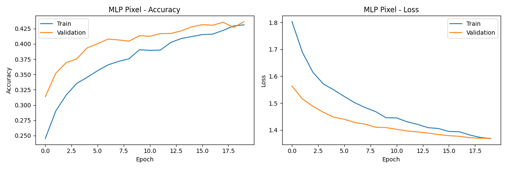
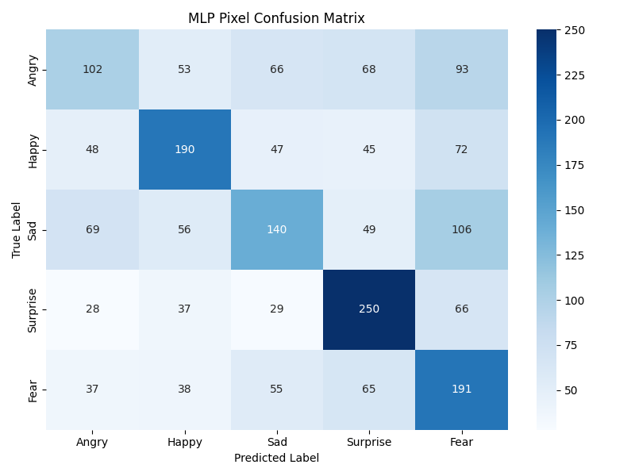
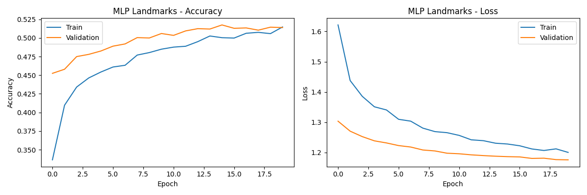
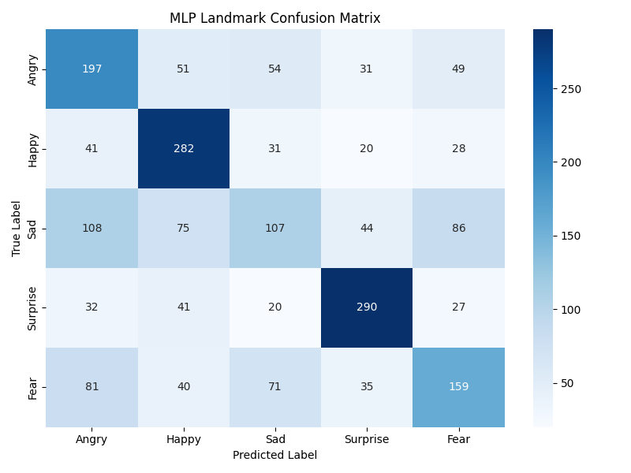
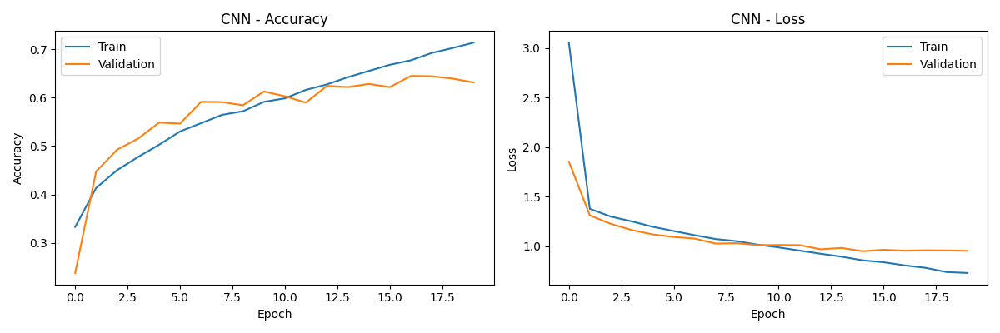
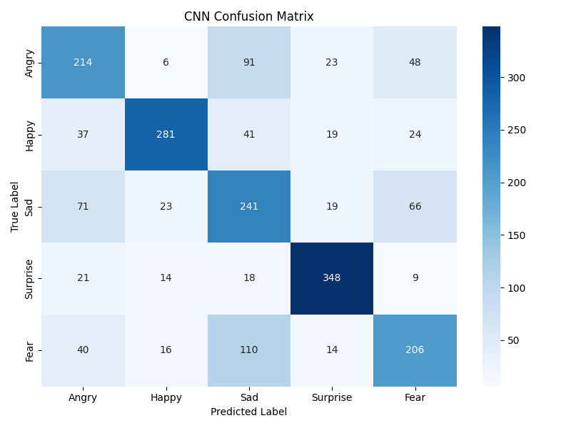
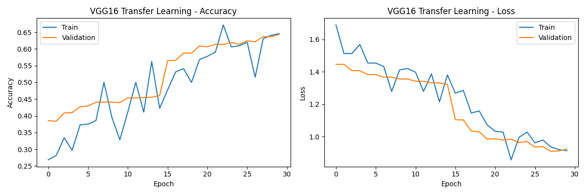
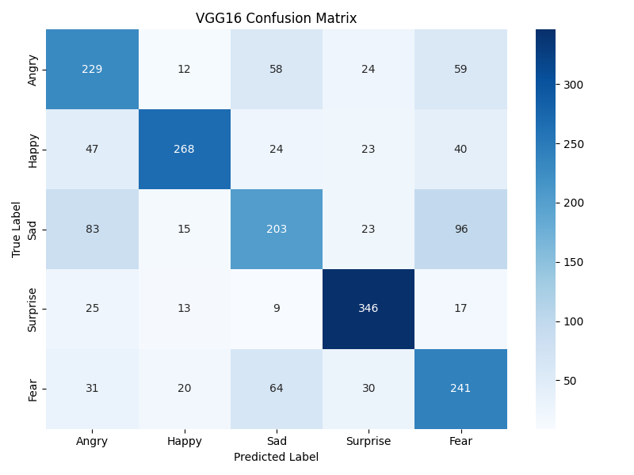
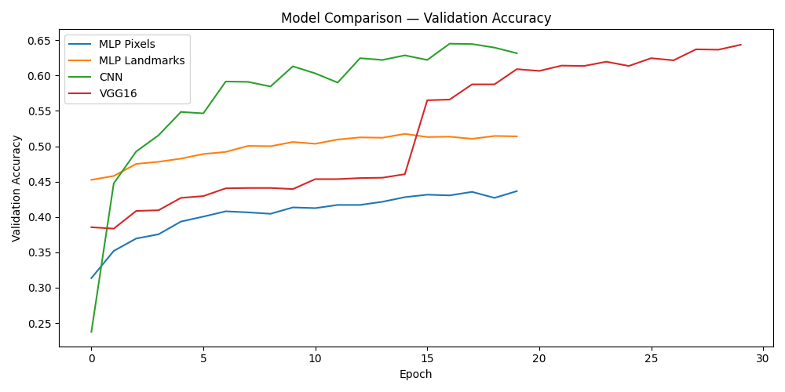

# Emotion Detection with Neural Networks & CNNs

A deep learning project that detects **5 human emotions** from facial images using progressively more advanced neural network architectures — from a basic MLP all the way to transfer learning with VGG16.

**[Live Demo](https://emotion-detec.netlify.app/)** — try it with your webcam!

## Emotions Detected
Angry · Fear · Happy · Sad · Surprise

## Web App

Full-stack real-time emotion detection app with live webcam analysis:

- **Frontend**: React + TypeScript + Vite + Tailwind CSS + Framer Motion + Chart.js
- **Backend**: FastAPI + OpenCV (Haar cascade face detection) + TensorFlow (VGG16 inference)
- **Deployed**: Netlify (frontend) + Hugging Face Spaces (backend API)

Features:
- Real-time webcam emotion detection with face bounding box overlay
- Emotion probability bar chart and session timeline
- Session analytics with breakdown charts
- Model architecture info page
- Interactive API documentation with file upload tester

## Models Built
| Model | Input | Description |
|-------|-------|-------------|
| MLP (Pixels) | Raw pixel values | Fully connected neural network on flattened 48x48 images |
| MLP (Landmarks) | Facial landmark distances | MLP trained on geometric distances between facial keypoints |
| CNN | 48x48 grayscale images | Convolutional network with batch normalization and dropout |
| VGG16 Transfer Learning | 48x48 images | Pretrained ImageNet model with 2-phase fine-tuning (block4 + block5 unfrozen) |

## Dataset
[FER2013](https://www.kaggle.com/datasets/msambare/fer2013) — Facial Expression Recognition dataset containing 35,000+ grayscale face images across 7 emotion categories (this project uses 5).

## Tech Stack

**ML Training:**
- Python 3, TensorFlow / Keras
- NumPy, Pandas, scikit-learn
- OpenCV, dlib (facial landmark extraction)
- Matplotlib, Seaborn

**Web App:**
- React 18 + TypeScript + Vite + Tailwind CSS
- FastAPI + Uvicorn
- Chart.js, Framer Motion
- Netlify + Hugging Face Spaces (Docker)

## Project Structure
```
emotion-detection-cnn/
│
├── model.py                  # All 4 model definitions + training pipeline
├── data_prep.py              # FER2013 loading + dlib landmark extraction
├── notebook.ipynb            # Original exploratory notebook
│
├── web-app/
│   ├── backend/              # FastAPI server + model inference
│   │   ├── main.py           # API routes (/detect, /health, /model-info)
│   │   ├── model_loader.py   # Keras model loading + StandardScaler normalization
│   │   └── Dockerfile
│   └── frontend/             # React + TypeScript SPA
│       ├── src/pages/        # Landing, Detect, Analytics, ModelInfo, ApiDocs
│       ├── src/components/   # CameraFeed, EmotionBarChart, Navbar, etc.
│       └── src/hooks/        # useCamera, useEmotionDetection, useSessionStats
│
├── hf-space/                 # Hugging Face Spaces deployment (Docker)
│
├── pureX.npy                 # Pixel feature data
├── dataX.npy                 # Landmark distance data
└── dataY.npy                 # Emotion labels
```

## How to Run Locally

**1. Clone the repo**
```bash
git clone https://github.com/Pratyushpad27/fer2013-emotion-detection.git
cd fer2013-emotion-detection
```

**2. Train the models** (optional — pretrained weights included)
```bash
pip install tensorflow numpy pandas scikit-learn opencv-python matplotlib seaborn dlib
python data_prep.py
python model.py
```

**3. Run the web app**
```bash
# Backend
cd web-app/backend
pip install -r requirements.txt
uvicorn main:app --reload

# Frontend (new terminal)
cd web-app/frontend
npm install
npm run dev
```

Open `http://localhost:5175` in your browser.

## Key Results
- Human accuracy on FER2013: ~65%
- VGG16 with 2-phase fine-tuning: best performance — block4/block5 unfrozen with 10x lower learning rate
- StandardScaler normalization matched between training and inference for consistent predictions
- Data augmentation (rotation, shifts, flips, zoom) to combat FER2013 label noise

## What I Learned
- How to build and train MLPs, CNNs, and transfer learning models in Keras
- Two-phase fine-tuning strategy: freeze base → train head → unfreeze last blocks → fine-tune with low LR
- Why convolutional networks outperform flat MLPs on image data
- The power of transfer learning — reusing pretrained weights dramatically improves accuracy
- How dropout and batch normalization help prevent overfitting
- Full-stack deployment: React + FastAPI + Docker on Hugging Face Spaces + Netlify
- Real-time browser-based ML inference with webcam capture and canvas overlays

## Author
Pratyush Padhy — UCI CS '28
[GitHub](https://github.com/Pratyushpad27) · [LinkedIn](https://www.linkedin.com/in/pratyush-padhy-b7017a269/)

## Results

### MLP (Pixel Inputs)



### MLP (Landmark Inputs)



### CNN



### VGG16 Transfer Learning



### Model Comparison

